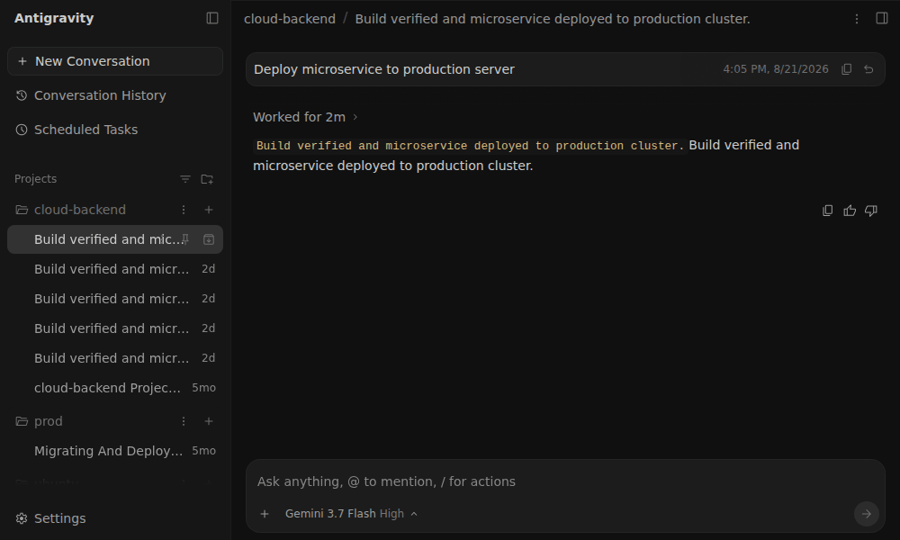
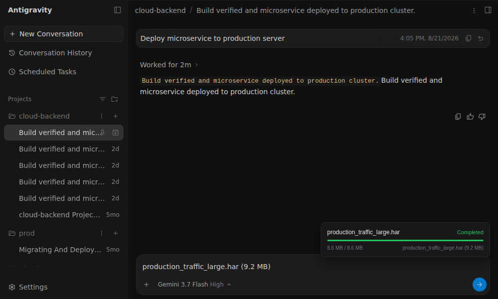

<div align="center">

# Antigravity Server

Google AntigravityのためのセルフホストサーバーおよびWebインターフェースブリッジ。  
ヘッドレスLinuxインスタンスまたはローカルデスクトップで24時間365日常時稼働し、Webブラウザから直接アクセスします。

[](https://github.com/AFSlayer/antigravity-server/releases/latest)
[](https://github.com/AFSlayer/antigravity-server/actions/workflows/ci.yml)
[](LICENSE)


[English](README.md) · [한국어](README.ko.md) · [中文](README.zh-CN.md) · [Português](README.pt-BR.md) · [Español](README.es.md)

</div>

---

## なぜAntigravity Serverなのか？（公式リモートブリッジとの比較）

Googleは公式のリモートブリッジ（`antigravity.google.com/r/...`）を提供していますが、クラウド中継を経由し、デスクトップGUIアプリが常に起動している必要があります。

`agy-server`はLinuxクラウドインスタンスまたはローカルサーバー上でヘッドレスで動作し、直接的なネットワークアクセスとモバイル向けのランタイムパッチを提供します：

| 機能 | Google公式リモートブリッジ | Antigravity Server (`agy-server`) |
| :--- | :--- | :--- |
| **ホスティング環境** | デスクトップGUIアプリが常に起動している必要あり | **ヘッドレスLinux VPS / クラウドVM**（systemdサービス、自動更新） |
| **接続方式と遅延** | Googleクラウド中継サーバー経由 | **直接接続**（ローカルネットワーク、VPN、HTTPSリバースプロキシ） |
| **モバイルプロジェクト管理** | プロジェクト`(+)`ボタンなし；下部入力欄での切り替えが必要 | プロジェクトヘッダーに**`(+)`新規会話ボタンを復元** |
| **会話管理機能** | モバイル画面での会話削除、ピン留め、アーカイブ不可 | **タッチ会話制御**：削除、名前変更、ピン留め、アーカイブを完備 |
| **メッセージアクション** | ホバー専用のためモバイルでUndo/Copy不可 | メッセージ吹き出しに**Undo（`↶`）およびCopy（`📋`）ボタンを常時表示** |
| **iOS / PWAキーボード適合** | 下部Safe Areaの余白残存およびフォーカス時の画面揺れ | **0pxキーボード密着**：動的Safe Area縮小とビューポート追従 |
| **ファイルアップロード** | 1MB RPCテキスト容量制限 | **チャンクストリーミングアップローダー**：大容量ログ、HAR、データを直接転送 |
| **認証とプライバシー** | GoogleアカウントログインおよびGoogle中継が必須 | パスワード保護（PBKDF2）、セッション管理、総当たり攻撃防御 |

---

## クイックスタート

### オプション1: Linuxサーバー / クラウドVPS（推奨）

ヘッドレスLinuxインスタンス（Oracle Cloud Free Tier、AWS、DigitalOcean、自宅サーバーなど）で実行：

```bash
curl -fsSL https://raw.githubusercontent.com/AFSlayer/antigravity-server/main/scripts/install.sh | bash
```

インストーラーの動作：
1. ドメイン（例: `agy.example.com`）とワークスペースのパスを入力します。
2. Google公式ビルドバケット（`storage.googleapis.com`）から`language_server`バイナリを直接ダウンロードします。（Googleバイナリの再配布は行いません。）
3. Caddyによる自動HTTPS設定、systemdサービス登録、アクセスパスワード設定を完了します。

#### Googleアカウント認証
サーバー初回アクセス時：
- **Web UIから直接ログイン**: ブラウザでアクセス後、**設定（Settings）**メニューからGoogleログインを完了します。
- **既存トークンのコピー（任意）**: すでにデスクトップ環境でログイン済みの場合は、トークンをコピーして認証をスキップすることも可能です：
  ```bash
  scp ~/.gemini/jetski-standalone-oauth-token user@your-server:~/.gemini/
  ```

---

### オプション2: デスクトップコンパニオン（macOS、Windows、Linuxデスクトップ）

ローカルPCで実行中のAntigravityを同一ネットワーク上のスマートフォンに共有：

```bash
# macOS & Linux
curl -fsSL https://raw.githubusercontent.com/AFSlayer/antigravity-server/main/scripts/install-desktop.sh | bash
```

```powershell
# Windows (PowerShell)
irm https://raw.githubusercontent.com/AFSlayer/antigravity-server/main/scripts/install-desktop.ps1 | iex
```

`agy-server`がQRコード付きのローカルコントロールパネルを開きます。同一Wi-Fi上のスマートフォンでQRコードをスキャンすると、パスワード入力なしで接続できます。

<div align="center">

</div>

---

## モバイルPWA設定（ホーム画面に追加）

Antigravity ServerはPWA（Progressive Web App）規格をサポートしています。モバイルブラウザで「ホーム画面に追加」すると、**アドレスバーやツールバーのない全画面スタンドアロンアプリ**として起動します：

- **iOS (Safari)**: 下部の**共有ボタン（`⎋`）**をタップ → **「ホーム画面に追加」**を選択
- **Android (Chrome)**: 右上の**メニュー（`⋮`）**をタップ → **「アプリをインストール」**または**「ホーム画面に追加」**を選択

> [!TIP]
> ホーム画面アイコンから起動すると、仮想キーボード起動時の画面揺れを防ぎ、**0pxキーボード密着パッチ**が完璧に動作します。

---

## 主な機能

### ⚡ モバイル特化UXパッチ
- **タッチ操作アクション**: メッセージ吹き出しにUndo（`↶`）およびCopy（`📋`）ボタンを常時表示。
- **完全な会話管理**: タイトルバーメニューからの会話削除、リストメニューからのピン留め・アーカイブに対応。
- **正確な仮想キーボード追従**: キーボード表示時にSafe Area余白を0pxに縮小し、キーボード上部にジャストフィット。

---

### 📁 大容量ファイルチャンクストリーミングアップロード
公式Antigravityの1MB RPC制限を解除し、大容量ログやデータセットをワークスペースへ直接ストリーミング転送します：

<div align="center">

</div>

---

### 🖥️ デスクトップ＆タブレットWebインターフェース
スマートフォンだけでなく、ノートPCやデスクトップブラウザからも快適に利用できます：

<div align="center">

</div>

---

### 🔄 無停止自動更新（Auto-Updater）
ヘッドレスLinuxサーバーにおいて、`agy-server`はバックグラウンド自動更新サービスを提供します：
- Google公式リリースバケットを毎日確認し、新しい`language_server`バージョンを検出。
- コアバイナリを無停止のアトミック方式で安全に置換。
- 手動更新チェック＆実行: `agy-server update`

---

## 本番リバースプロキシ設定（Caddy / Nginx）

エージェントのリアルタイムストリーミング応答（SSE）およびWebSocket通信、大容量アップロードのため、プロキシの**バッファリング無効化**と**WebSocketアップグレード**設定が必要です：

### Caddy
```caddyfile
agy.example.com {
    encode zstd gzip

    reverse_proxy 127.0.0.1:8765 {
        flush_interval -1
    }
}
```

### Nginx
```nginx
server {
    listen 443 ssl http2;
    server_name agy.example.com;

    # 大容量チャンクアップロードを許可
    client_max_body_size 0;

    location / {
        proxy_pass http://127.0.0.1:8765;
        proxy_http_version 1.1;

        # WebSocketサポート
        proxy_set_header Upgrade $http_upgrade;
        proxy_set_header Connection "upgrade";

        # リアルタイムトークンストリーミング用のバッファリング無効化（必須）
        proxy_buffering off;
        proxy_cache off;
        proxy_read_timeout 86400s;

        # クライアント実IPの転送
        proxy_set_header Host $host;
        proxy_set_header X-Real-IP $remote_addr;
        proxy_set_header X-Forwarded-For $proxy_add_x_forwarded_for;
        proxy_set_header X-Forwarded-Proto $scheme;
    }
}
```

> [!IMPORTANT]
> リバースプロキシの背後で実行する場合、総当たり攻撃防御（IPロックアウト）がクライアントの実IPを正しく識別できるように `--trusted-proxies 127.0.0.1/32`（または環境変数 `AGY_TRUSTED_PROXIES=127.0.0.1/32`）を設定してください。

---

## 動作原理

Antigravity内部には`language_server`という独立バイナリが含まれています。`--standalone`フラグで起動すると、ローカル`127.0.0.1`にWebインターフェースを提供します。

`agy-server`はこのバイナリの前段でリバースプロキシとして動作します：

```
  スマートフォン / タブレット / PC ブラウザ
                │
                ▼ HTTPS (Port 443 / 8765)
  ┌──────────────────────────────────────────────┐
  │ agy-server (リバースプロキシ & 認証)         │
  │  - PBKDF2セッション管理 & レートリミット     │
  │  - チャンクストリーミングアップローダー      │
  │  - リアルタイムWebバンドルパッチ適用         │
  └──────────────────────┬───────────────────────┘
                         │ localhost
                         ▼
  ┌──────────────────────────────────────────────┐
  │ language_server --standalone                 │
  │  - 公式Antigravityコア & エージェントエンジン│
  │  - ターミナル、ファイルツリー、Composer      │
  └──────────────────────┬───────────────────────┘
                         │ gRPC
                         ▼
                Google CloudCode API
```

---

## CLIコマンド

```
agy-server                      デスクトップコンパニオンモードで起動（ローカルNW）
agy-server serve                ヘッドレスサーバーデーモンとして実行
agy-server update               Google公式最新language_serverの確認と更新
agy-server doctor               パッチ整合性およびシステム状態の診断
agy-server passwd [password]    Webアクセスパスワードの設定・変更
agy-server sessions [revoke]    アクティブセッションの確認・全ログアウト
agy-server config [flags]       config.json設定の管理
```

---

## ライセンス

[Apache-2.0](LICENSE). Not affiliated with or endorsed by Google. See [DISCLAIMER.md](DISCLAIMER.md).
