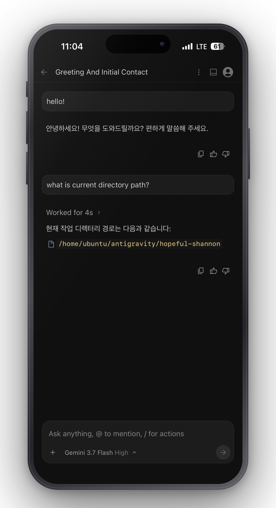

<div align="center">

# Antigravity Remote

### 진짜 Antigravity를 폰에서. 복제품이 아닙니다.

[](https://github.com/AFSlayer/antigravity-remote/releases/latest)
[](https://github.com/AFSlayer/antigravity-remote/actions/workflows/ci.yml)
[](LICENSE)
[](#설치)



**[30초 시작](#30초면-폰에서-됩니다) · [서버 모드](#서버-모드-나만의-클라우드-antigravity) · [보안](SECURITY.md) · [English](README.md)**

</div>

---

Antigravity 데스크톱 앱에는 이미 완전한 웹 IDE가 들어 있습니다. 함께 설치되는
`language_server` 바이너리가 그 UI 전체를 HTTPS로 서브하는데, `127.0.0.1`
바깥으로는 열어주지 않을 뿐입니다.

`agy-remote`는 그 문을 안전하게 여는 작은 Go 바이너리 하나입니다. 비밀번호로
보호되는 리버스 프록시, 타이핑 없이 폰을 로그인시키는 QR 코드, 그리고 데스크톱
IDE를 엄지손가락으로 쓸 수 있게 만드는 12개의 정밀한 패치가 들어 있습니다.

**진짜 그대로입니다.** 파일 탐색기, 터미널, artifacts, 브라우저 에이전트, 추론
단계까지 고를 수 있는 모델 선택기 — 전부 됩니다. 앞으로 Google이 추가하는 기능도
그대로 따라옵니다. 따라 만들 UI가 없기 때문입니다.

## 30초면 폰에서 됩니다

**1. 설치 + 실행** — 한 줄이면 되고, 설정할 것도 없습니다:

```bash
# macOS / Linux
curl -fsSL https://raw.githubusercontent.com/AFSlayer/antigravity-remote/main/scripts/install-desktop.sh | bash
```

```powershell
# Windows (PowerShell)
irm https://raw.githubusercontent.com/AFSlayer/antigravity-remote/main/scripts/install-desktop.ps1 | iex
```

**2. QR 스캔** — 자동으로 열리는 제어판의 QR을 폰으로 찍으면 끝입니다. 비밀번호를
입력할 필요도 없습니다.

<div align="center">

</div>

Antigravity가 실행 중이 아니어도 됩니다. `agy-remote`가 앱을 켜고, 원격 제어
설정을 활성화하고, language server 포트를 찾아서 네트워크로 연결해줍니다. 다음
실행부터는 `agy-remote`만 입력하면 됩니다.

> **홈 화면에 추가하세요.** 폰에서 공유 → *홈 화면에 추가*를 누르면 브라우저 UI
> 없이 Antigravity 아이콘으로 전체화면 실행됩니다. 이 페이지의 스크린샷이 바로
> 그 상태입니다.

### 보안 경고 없이 설치하기

이 빌드에는 코드 서명이 없습니다. Apple과 Microsoft 모두 서명에 연 사용료를
받기 때문입니다. 위 명령 대신 브라우저로 압축 파일을 직접 받으면 OS가 파일을
격리합니다:

- **macOS** — *"확인할 수 없는 개발자이기 때문에 열 수 없습니다."* 파일을
  우클릭 → **열기** → 다시 **열기**를 누르세요. 또는 격리 속성을 제거:
  `xattr -d com.apple.quarantine agy-remote`
- **Windows** — *"Windows가 PC를 보호했습니다."* **추가 정보** → **실행**을 누르세요.

원라인 설치 스크립트는 `curl` / `Invoke-WebRequest`로 받기 때문에 격리 속성이
붙지 않고, 그래서 이 경고를 아예 보지 않습니다. 스크립트가 존재하는 이유가
정확히 이것입니다.

## 서버 모드: 나만의 클라우드 Antigravity

리눅스 서버라면 한 줄로 끝납니다. 5달러 VPS, 집에 있는 서버, Oracle 무료 ARM
인스턴스 어디든 됩니다:

```bash
curl -fsSL https://raw.githubusercontent.com/AFSlayer/antigravity-remote/main/scripts/install.sh | bash
```

설치 스크립트가 도메인과 워크스페이스 폴더를 물어본 다음:

- Google의 `storage.googleapis.com`에서 **공식** Antigravity 빌드를 직접 받아
  165MB `language_server`만 추출합니다. 이 프로젝트는 Google 바이너리를 재배포하지
  않습니다.
- Antigravity가 항상 떠 있도록 systemd 유닛을 등록합니다.
- 도메인에 Caddy로 HTTPS를 자동 설정합니다.
- 접속 비밀번호를 생성합니다.

이제 노트북을 닫아도 계속 일하는 에이전트가 생깁니다.

> **수동으로 해야 하는 한 단계.** Antigravity는 `localhost` OAuth 콜백으로
> 로그인하는데, 원격 서버는 그 콜백을 받을 수 없습니다. 데스크톱 앱을 이미 쓰고
> 있는 컴퓨터에서 토큰을 복사해 주세요:
>
> ```bash
> scp ~/.gemini/jetski-standalone-oauth-token you@your-server:~/.gemini/
> ```
>
> 토큰이 없으면 `agy-remote`가 이 명령을 그대로 출력해 줍니다.

## 다른 프로젝트를 쓰면 안 되나요?

"폰에서 Antigravity 쓰기" 프로젝트는 이미 열 개가 넘습니다. 전부 UI를 만듭니다.
자체 채팅 패널을 만들거나, Chrome DevTools Protocol로 화면을 미러링합니다.

이 프로젝트는 UI를 만들지 않습니다.

|  | 다른 프로젝트 | Antigravity Remote |
| --- | --- | --- |
| UI | 재구현 또는 화면 미러링 | **Antigravity 자체 웹 UI** |
| 기능 범위 | 이식한 만큼만 | **전부** — 터미널, artifacts, 브라우저 에이전트, diff |
| 신기능 대응 | 메인테이너가 따라 만들 때까지 | **Google이 배포한 날 바로 동작** |
| 실행 환경 | 대개 Node.js + 패키지 설치 | **정적 바이너리 1개, 의존성 1개** |
| 헤드리스 서버 호스팅 | 드묾 | **1급 기능** |

트레이드오프는 솔직하게 말씀드립니다. Google 번들의 문자열을 패치하기 때문에
Antigravity 업데이트가 패치를 깨뜨릴 수 있습니다. 그래서 `agy-remote`는 시작할
때마다 모든 패치를 검사하고, 조용히 실패하는 대신 **알려줍니다**. 언제든
`agy-remote doctor`로 어떤 패치가 적용됐는지 확인할 수 있습니다.

## 모바일 개선 사항

데스크톱 IDE를 폰 브라우저에서 쓰면 걸리는 데가 많습니다. 그 부분들을 다듬었고,
각각은 [`internal/patches/registry.go`](internal/patches/registry.go)에 이름이
붙은 패치로 들어 있어 그대로 확인할 수 있습니다.

| 문제 | 개선 |
| --- | --- |
| 앱이 `https://127.0.0.1:<port>`로 통신해서 폰에서는 아예 안 됨 | 브라우저 자신의 origin으로 교정 |
| 문장 쓰는 중에 엔터를 누르면 메시지가 전송됨 | 터치 기기에서는 **엔터가 줄바꿈**, Cmd/Ctrl+엔터가 전송 |
| iOS 홈 바가 입력창을 가림 | `safe-area-inset-bottom` 반영, 키보드가 올라오면 여백 자동 축소 |
| 모델을 탭하면 "중간"으로 선택되고 팝업이 닫힘 | 탭하면 **추론 단계 서브메뉴**가 열림 |
| 동작할 수 없는 마이크 버튼 (스탠드얼론에는 전사 기능 없음) | 숨김 |
| 새 프로젝트가 `/`에서 시작 | 지정한 워크스페이스 경로에서 시작 |
| 앱 아이콘 없음, 300ms 탭 지연, 브라우저 UI가 화면 차지 | 공식 아이콘, 즉각 반응, 웹 매니페스트로 **홈 화면에 추가** 시 전체화면 |

패치 없이 원본 그대로 쓰고 싶다면 `agy-remote --no-mobile-patches`.

<div align="center">
<table>
<tr>
<td align="center" width="33%"></td>
<td align="center" width="33%"></td>
<td align="center" width="33%"></td>
</tr>
<tr>
<td align="center"><sub>모든 모델을 탭으로</sub></td>
<td align="center"><sub>추론 단계까지 선택</sub></td>
<td align="center"><sub>설정도 축약판이 아닌 원본</sub></td>
</tr>
</table>
</div>

## 보안

Antigravity에 접근할 수 있다는 건 셸에 접근할 수 있다는 뜻입니다. 그만큼 신경
썼습니다.

- 비밀번호는 PBKDF2-SHA256(20만 회) 해시로 저장하며, 평문으로 남기지 않습니다.
- 256비트 세션 토큰을 **해시만** 저장하고, 제어판에서 즉시 폐기할 수 있습니다.
- 로그인 레이트리밋 — IP별·전역, 지수 백오프 락아웃.
- 쿠키에 `HttpOnly` + `SameSite=Lax`, HTTPS 요청이면 `Secure`까지.
- QR 코드는 **1회용** 10분 만료 등록 토큰입니다.
- QR·비밀번호·종료 버튼이 있는 제어판은 **루프백 전용 별도 포트**에서만
  동작하며, 네트워크에 노출되지 않습니다.

공개 주소에 올리기 전에 [SECURITY.md](SECURITY.md)를 읽어주세요. 요약하면,
가능하면 Tailscale 안에 두고, 안 되면 반드시 HTTPS를 쓰세요.

## 명령어

```
agy-remote                     데스크톱 앱을 같은 망에 공유
agy-remote serve               서버에서 헤드리스로 실행
agy-remote doctor              전체 점검 후 문제점 출력
agy-remote config [flags]      옵션을 config.json에 저장
agy-remote passwd [password]   접속 비밀번호 설정
agy-remote sessions [revoke]   로그인된 기기 목록 / 전체 로그아웃
```

자주 쓰는 플래그: `--port`, `--bind`, `--public-url`, `--workspace-root`,
`--trusted-proxies`, `--session-days`, `--no-mobile-patches`,
`--language-server`. 모두 `AGY_*` 환경변수로도 설정할 수 있고,
`agy-remote help`에 전부 나옵니다.

## 동작 원리

```
     내 폰                        내 컴퓨터 / 서버
 ┌──────────┐            ┌──────────────────────────────────┐
 │ 브라우저 │            │  agy-remote                      │
 │          │  비밀번호  │  ┌────────────────────────────┐  │
 │  Anti-   │◄──────────►│  │ 비밀번호 + 세션            │  │
 │ gravity  │   :8765    │  │ 레이트리밋                 │  │
 │   UI     │            │  ├────────────────────────────┤  │
 └──────────┘            │  │ main.js / index.html 패치  │  │
                         │  └─────────────┬──────────────┘  │
                         │                │ https           │
                         │  ┌─────────────▼──────────────┐  │
                         │  │ language_server            │  │
                         │  │ --standalone  (Google)     │  │
                         │  └─────────────┬──────────────┘  │
                         └────────────────┼─────────────────┘
                                          │
                                   Google CloudCode
```

`agy-remote`는 프롬프트나 코드를 프록시되는 바이트로만 다루며, 같은 호스트의
language server 외 어디로도 보내지 않습니다.

## 자주 묻는 질문

**Antigravity IDE나 CLI로도 되나요?**
안 됩니다. **데스크톱 앱**("Antigravity IDE"가 아니라 "Antigravity")이 필요합니다.
웹 UI를 서브하는 `language_server --standalone`을 실행할 수 있는 건 데스크톱 앱뿐입니다.
CLI 바이너리도 번들을 품고 있지만, 그걸 서브하는 플래그가 없습니다.

**Antigravity가 업데이트되면 계속 쓸 수 있나요?**
프록시는 계속 동작합니다. 개별 패치는 깨질 수 있는데, `agy-remote`가 어떤 패치가
안 맞는지 알려줍니다. 원격 접속에 반드시 필요한 건 `base-url-origin` 하나뿐입니다.
깨지면 [이슈](https://github.com/AFSlayer/antigravity-remote/issues)를 남겨주세요.

**내 코드가 제3자에게 전송되나요?**
아닙니다. 프록시도, language server도 내 컴퓨터 안에 있습니다. Antigravity가
Google과 주고받는 통신은 그대로입니다.

**여러 명이 동시에 쓸 수 있나요?**
기기마다 세션은 따로지만 Antigravity 인스턴스와 Google 계정은 하나를 공유합니다.
팀 서버가 아니라 내 여러 기기용 설정으로 생각하세요.

**LAN에서는 HTTP가 괜찮은데 인터넷에서는 안 되는 이유는?**
폰 브라우저는 자체 서명 인증서를 거부하고, `192.168.x.x`로는 정식 인증서를 받을
수 없습니다. 신뢰하는 망에서는 감수할 만한 트레이드오프지만, 공개 주소라면
`--public-url`과 Caddy 또는 터널을 써서 전부 HTTPS로 감싸주세요.

## 개발

```bash
go test ./...            # 패치 엔진, 인증, 프록시
go run ./cmd/agy-remote  # 로컬 모드
```

핵심은 패치 엔진입니다: [`internal/patches`](internal/patches). 모든 패치는 앵커
문자열을 가진 선언적 구조체이고, `All()`에 항목을 추가하는 것만으로 테스트·doctor
리포트·제어판·캐시 키가 모두 따라옵니다.

Antigravity 번들을 저장소에 포함하지 않기 때문에 패치 검증은 두 단계로 나뉩니다:

- `patches_test.go` — 레지스트리로부터 **합성** 문서를 만들어 엔진 자체를 검증
  (매칭, 순서, head 주입, 비활성 패치, 캐시 키).
- `live_test.go` — 실행 중인 language server에서 **실제** 번들을 받아 각 앵커가
  정확히 1번 매칭되는지 검증합니다. 실행 중이 아니면 skip하므로, 릴리즈 전에는
  Antigravity 데스크톱 앱을 켜고 돌려주세요:

  ```bash
  go test ./internal/patches -run Live -v
  ```

`agy-remote doctor`가 사용자 환경에서 동일한 실검증을 수행합니다. 앵커가 깨졌을 때
조용히 아무 일도 안 하는 대신 보고되는 이유입니다.

## 라이선스

[Apache-2.0](LICENSE). Google과 무관한 프로젝트입니다.
[DISCLAIMER.md](DISCLAIMER.md)를 읽어주세요.
