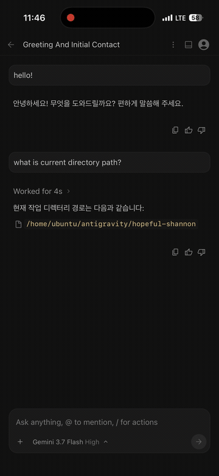
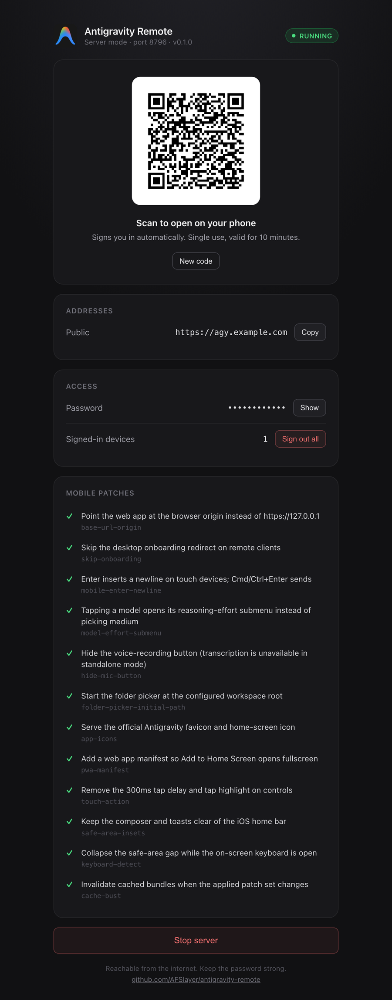
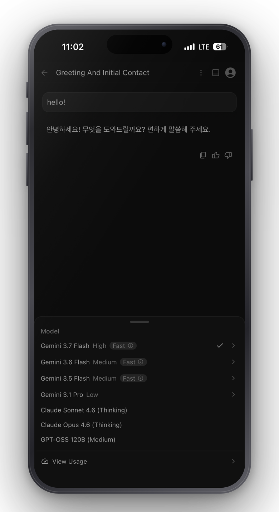
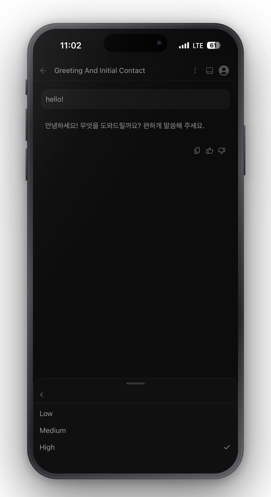
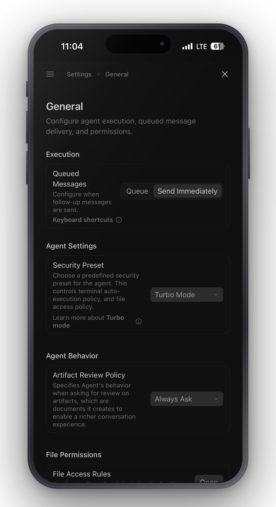

<div align="center">

# Antigravity Remote

**Antigravity 데스크톱 앱을 폰에서 쓰기.**

[](https://github.com/AFSlayer/antigravity-remote/releases/latest)
[](https://github.com/AFSlayer/antigravity-remote/actions/workflows/ci.yml)
[](LICENSE)



[English](README.md) · [中文](README.zh-CN.md) · [日本語](README.ja.md) · [Português](README.pt-BR.md) · [Español](README.es.md)

</div>

## 뭔가

Antigravity 데스크톱 앱에는 `language_server`라는 바이너리가 들어 있다. Google과
통신하는 건 이 녀석이고, `--standalone`을 붙이면 Antigravity UI 전체를 웹앱으로도
서브한다. 듣는 주소가 `127.0.0.1` 뿐이라는 게 문제다.

`agy-remote`는 그 앞에 비밀번호를 걸고 내 네트워크로 넘겨준다. 지나가는 JS 번들의
문자열도 몇 개 고쳐 쓴다. 데스크톱 IDE를 폰 브라우저에서 쓰면 걸리는 데가 있어서다.

같은 일을 하는 프로젝트들은 자체 UI를 만들거나 CDP로 화면을 미러링한다. 이건
Antigravity 자기 UI를 서브한다. 그래서 터미널, 파일 트리, artifacts, 브라우저
에이전트가 다 되고, Google이 기능을 추가해도 이쪽에서 할 일이 없다.

단점은 압축된 번들에 패치를 거는 게 깨지기 쉽다는 것이다. Antigravity가 업데이트되면
패치가 안 맞을 수 있다. `agy-remote`는 시작할 때 전부 검사해서 안 맞는 걸 알려준다.

## 설치

```bash
# macOS, Linux
curl -fsSL https://raw.githubusercontent.com/AFSlayer/antigravity-remote/main/scripts/install-desktop.sh | bash
```

```powershell
# Windows
irm https://raw.githubusercontent.com/AFSlayer/antigravity-remote/main/scripts/install-desktop.ps1 | iex
```

설치하고 바로 뜬다. 제어판이 열리고 QR 코드가 나온다. 폰으로 찍으면 끝이고 비밀번호는
안 쳐도 된다. QR에 10분짜리 1회용 토큰이 들어 있다.

<div align="center">

</div>

Antigravity를 미리 켜둘 필요는 없다. 안 켜져 있으면 `agy-remote`가 앱을 띄우고, 원격
제어를 켜고, language server를 기다린 다음 어느 포트가 UI를 서브하는지 알아낸다.

폰에서는 공유 → *홈 화면에 추가*를 쓰면 된다. 홈 화면에 Antigravity 아이콘이 생긴다.

바이너리에 코드 서명이 없어서 브라우저로 압축 파일을 받으면 OS가 격리한다. macOS는
우클릭 → **열기** → 다시 **열기**. Windows는 **추가 정보** → **실행**. 위 설치 명령은
`curl`을 쓰는데 그러면 격리 속성이 안 붙어서 이 과정을 안 겪는다.

## 서버에 올리면

리눅스 서버에 올려두면 노트북을 닫아도 Antigravity가 계속 돌아간다. 싼 VPS나 무료 등급
ARM 인스턴스로 충분하다.

```bash
curl -fsSL https://raw.githubusercontent.com/AFSlayer/antigravity-remote/main/scripts/install.sh | bash
```

도메인과 워크스페이스 폴더를 물어보고, Google의 `storage.googleapis.com`에서 공식
Antigravity 빌드를 받아 165MB `language_server`만 꺼낸다. 이 저장소가 Google 바이너리를
재배포하지는 않는다. 그다음 systemd 유닛을 쓰고 Caddy로 HTTPS를 붙이고 비밀번호를
만든다.

같은 웹 UI라서 PC 브라우저로도 접속된다. 생김새도 동작도 데스크톱 앱과 똑같다. 대화,
워크스페이스, 돌고 있는 에이전트가 다 서버에 있으니까 지하철에서 폰으로 시작한 작업을
사무실 데스크톱에서 그대로 이어서 할 수 있다. 인스턴스가 하나라서 동기화라는 개념 자체가
없다.

한 단계는 자동이 안 된다. Antigravity 로그인은 `localhost` OAuth 콜백을 쓰는데 원격
서버는 그걸 받을 수 없다. 데스크톱 앱을 쓰는 컴퓨터에서 토큰을 복사해야 한다.

```bash
scp ~/.gemini/jetski-standalone-oauth-token you@your-server:~/.gemini/
```

토큰이 없으면 `agy-remote`가 이 명령을 찍어준다.

## 뭘 패치하나

13개. 각각 설명이 [`internal/patches/registry.go`](internal/patches/registry.go)에
있다. 어떤 게 적용됐는지는 `agy-remote doctor`로 본다.

| 문제 | 패치 |
| --- | --- |
| 번들이 `https://127.0.0.1:<port>`로 호출한다. 폰에서는 그게 폰이다 | 브라우저 origin을 쓴다 |
| 문장 쓰는 중에 엔터를 누르면 전송된다 | 터치에서는 엔터가 줄바꿈, Cmd/Ctrl+엔터가 전송 |
| 모델을 탭하면 medium으로 선택되고 팝업이 닫힌다 | 탭하면 추론 단계 서브메뉴가 열린다 |
| 첫 답변 뒤 "Enable Notifications" 배너가 뜬다 | 터치 기기에서는 건너뛴다 |
| 스탠드얼론에는 전사가 없는데 마이크 버튼이 있다 | 숨긴다 |
| 새 프로젝트가 `/`에서 시작한다 | 지정한 워크스페이스 폴더에서 시작 |
| 아이콘 없음, 300ms 탭 지연 | Antigravity 아이콘, 즉시 반응 |

원본 그대로 보려면 `agy-remote --no-mobile-patches`.

<div align="center">
<table><tr>
<td align="center"></td>
<td align="center"></td>
<td align="center"></td>
</tr></table>
</div>

## 보안

들어온 사람은 파일을 읽고 명령을 실행할 수 있다. 문서 공유가 아니라 셸 접근을 주는
쪽에 가깝다.

- 비밀번호는 PBKDF2-SHA256 20만 회로 해시한다. 평문으로 두는 곳은 없다.
- 세션 토큰은 랜덤 256비트고 디스크에는 해시만 쓴다. `sessions.json`을 가져가도 못 쓴다.
- IP당 5분에 5회 실패까지, 그 뒤로는 최대 30분까지 두 배씩 늘어나는 락아웃. 맞는
  비밀번호도 같이 막힌다.
- QR 코드와 종료 버튼이 있는 제어판은 별도 포트에서 루프백만 듣는다. 네트워크로 안 나간다.

리버스 프록시 뒤에 둘 거면 신뢰할 peer를 지정해야 한다. 안 하면 forwarded 헤더를 무시한다.

```bash
agy-remote serve --public-url https://agy.example.com --trusted-proxies 127.0.0.1/32
```

나머지는 [SECURITY.md](SECURITY.md)에 있다. 가능하면 Tailscale, 안 되면 HTTPS.

## 명령어

```
agy-remote                     데스크톱 앱을 내 네트워크에 공유
agy-remote serve               서버에서 헤드리스로 실행
agy-remote doctor              전체 점검하고 문제점 출력
agy-remote config [flags]      옵션을 config.json에 저장
agy-remote passwd [password]   비밀번호 설정
agy-remote sessions [revoke]   기기 목록 / 전체 로그아웃
```

플래그는 `agy-remote help`에 다 나온다. 전부 `AGY_*` 환경변수가 있다.

```
    폰                          내 컴퓨터 또는 서버
┌──────────┐              ┌────────────────────────────────┐
│ 브라우저 │   비밀번호   │ agy-remote                     │
│          │◄────────────►│   세션, 레이트리밋             │
│  Anti-   │    :8765     │   main.js / index.html 패치    │
│ gravity  │              │              │ https           │
│   UI     │              │   language_server --standalone │
└──────────┘              └──────────────┼─────────────────┘
                                         ▼
                                  Google CloudCode
```

프롬프트와 코드는 같은 호스트의 language server로만 가고 다른 데로는 안 간다.

## 자주 묻는 것

**IDE나 CLI로도 되나?** 안 된다. 그냥 "Antigravity"인 데스크톱 앱이어야 한다.
`language_server --standalone`을 띄울 수 있는 게 그것뿐이다. CLI에도 번들은 들어 있는데
서브하는 플래그가 없다.

**업데이트되면 계속 되나?** 프록시는 된다. 개별 패치는 깨질 수 있다. 원격 접속에 꼭
필요한 건 `base-url-origin` 하나다. 깨지면 이슈를 남겨주면 된다.

**내 코드가 밖으로 나가나?** 안 나간다. 프록시도 language server도 내 컴퓨터에서 돈다.

**둘이 써도 되나?** 기기마다 세션은 따로지만 Antigravity와 Google 계정은 하나를 공유한다.
팀용이 아니라 내 기기용이다.

## 개발

```bash
go test ./...
go run ./cmd/agy-remote
```

볼 만한 건 [`internal/patches`](internal/patches)다. 패치는 앵커 문자열을 가진 구조체고,
`All()`에 하나 넣으면 테스트, `doctor`, 제어판, 캐시 키가 알아서 받아간다.

Antigravity 번들은 이 저장소에 없다. 그래서 `patches_test.go`는 합성 문서로 엔진을
테스트하고, `live_test.go`는 실행 중인 language server에서 실제 번들을 받아 앵커를
확인한다(안 켜져 있으면 skip). 태그 붙이기 전에 데스크톱 앱을 켜고
`go test ./internal/patches -run Live -v`를 돌리면 된다.

## 라이선스

[Apache-2.0](LICENSE). Google 프로젝트가 아니다. [DISCLAIMER.md](DISCLAIMER.md) 참고.
